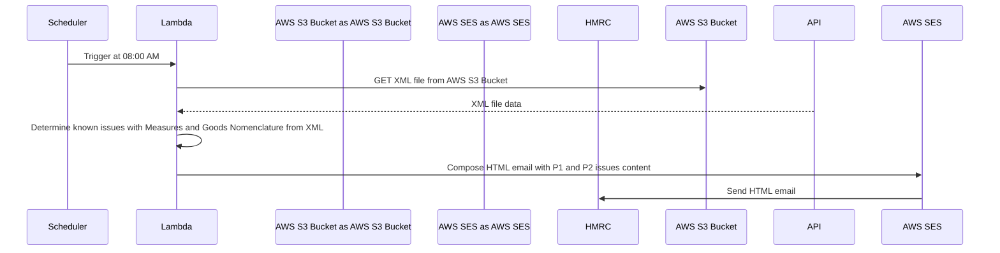

# trade-tariff-lambdas-uk-issues-mailer

Scheduled go lambda function to notify HMRC team when there are priority 1 and priority 2 issues with the latest CDS files.

This is anticipated to help with early alerting with these issues

